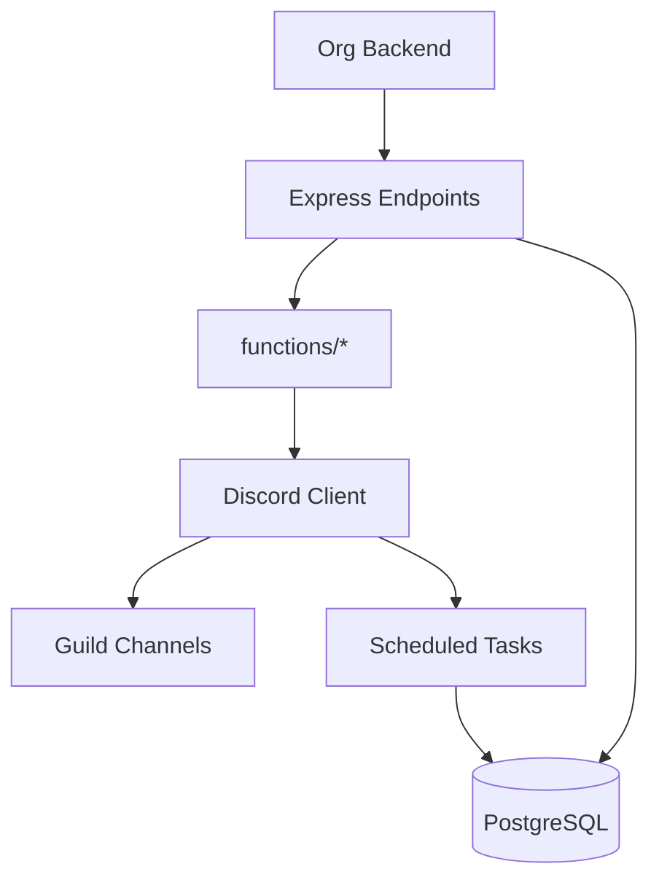

# Beowulf Discord Bot
Data-driven Discord automation for Star Citizen org operations: hit tracking, fleets/schedules, leaderboards, awards, and market insights.

## Overview
Beowulf combines deterministic data pipelines (UEX market data, stats, schedules) with Discord automation. It offers HTTP endpoints for backend-triggered events plus scheduled background jobs — no slash-commands or conversational handlers remain in this build.

### Quick Start
1) Create a `.env` from `ENVIRONMENT.md` (or a future `.env.example`).
2) Install dependencies and bootstrap folders (logs, chatlogs created via postinstall).
3) Run in test mode (default) or set `LIVE_ENVIRONMENT=true` for production.

```bash
npm install
npm run start
```

For process supervision in production, see `docs/OPERATIONS.md` (PM2 recommended).

### Clearing legacy slash commands (temporary helper)
If Discord still shows outdated slash commands from previous versions, run the purge helper. It deletes both global and guild-scoped commands for live/test apps based on your `.env` values.

```bash
npm run clear:commands               # uses .env by default
npm run clear:commands -- path/to/.env.other   # optional alt env file
```

Run it once after redeploying the GPT-free build, or anytime stray commands linger.

### Architecture snapshot


## Hit Tracker features

- Hits are created through the backend API (`/hittrackcreate`) or automation jobs instead of slash commands.
- Edits and deletions are likewise triggered via API payloads (`/hittrackdelete`) and reflected in Discord threads.
- When a hit arrives, the bot posts crew prompts so you can @mention assists or reply "none" directly in the thread.
- Deleting a hit removes the database record but leaves a red embed in the thread for historical context.

On deletion, the bot removes the database record but posts a red embed in the thread stating the hit was removed; the thread remains for history.


## Documentation Index
- `docs/ARCHITECTURE.md` – System overview, diagrams, modules
- `docs/ENVIRONMENT.md` – All environment variables by domain
- `docs/API.md` – Express HTTP endpoints + OpenAPI draft
- `docs/SCHEDULES-JOBS.md` – All recurring jobs, cadences, dependencies
- `docs/DATA-FLOWS.md` – End-to-end data lifecycles
- `docs/VECTOR-INGEST.md` – Embedding & vector store pipelines
- `docs/OPERATIONS.md` – Runbook: start/stop, PM2, recovery
- `docs/SECURITY.md` – Tokens, permissions, privacy
- `docs/TROUBLESHOOTING.md` – Common issues and fixes
- `docs/CONTRIBUTING.md` – Conventions & contribution guide
- `docs/market-data.md` – Detailed market cache and answerers (existing)

## Contributing
See `docs/CONTRIBUTING.md` for coding standards, branching, and PR guidance.

