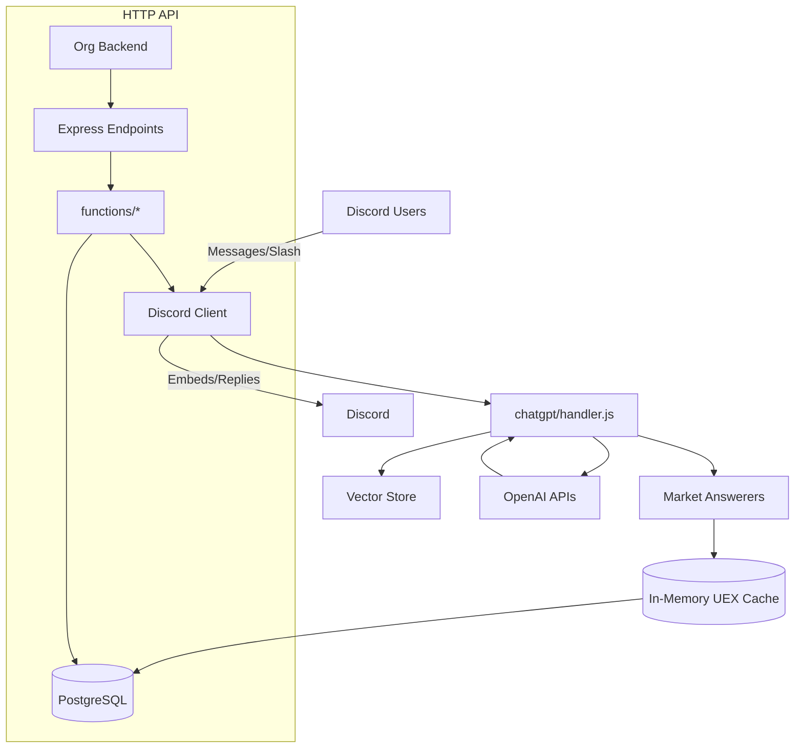

# Beowulf Discord Bot
Intelligent, data-driven Discord automation for Star Citizen org operations: conversational assistance, hit tracking, fleets/schedules, leaderboards, awards, and market insights.

## Overview
Beowulf combines deterministic data pipelines (UEX market data, stats, schedules) with retrieval-augmented AI responses. It offers HTTP endpoints for backend-triggered events and a modular command/event system for Discord.

### Quick Start
1) Create a `.env` from `ENVIRONMENT.md` (or a future `.env.example`).
2) Install dependencies and bootstrap folders (logs, chatlogs created via postinstall).
3) Run in test mode (default) or set `LIVE_ENVIRONMENT=true` for production.

```bash
npm install
npm run start
```

For process supervision in production, see `docs/OPERATIONS.md` (PM2 recommended).

### Architecture snapshot


## Hit Tracker features

- Create hits via natural language or `/hit-tracker-add`.
- Edit your hit inside its thread with simple phrases like "edit value to 14000".
- When creating a hit, the bot will also ask for assists (crew). You can @mention multiple users or reply "none".
- Delete your own hit via:
	- Natural language: "delete hit 123" or "remove this hit" (only the original author may delete).
	- Slash command: `/hit-tracker-remove` with autocomplete for your hits.

On deletion, the bot removes the database record but posts a red embed in the thread stating the hit was removed; the thread remains for history.

Tip: To add someone to an existing hit, you can simply say "add @User to the hit" or "add PlayerName to the hit" inside the hit thread (or specify the hit ID). The per-share cuts will be recalculated automatically.

## Documentation Index
- `docs/ARCHITECTURE.md` – System overview, diagrams, modules
- `docs/ENVIRONMENT.md` – All environment variables by domain
- `docs/API.md` – Express HTTP endpoints + OpenAPI draft
- `docs/SCHEDULES-JOBS.md` – All recurring jobs, cadences, dependencies
- `docs/DATA-FLOWS.md` – End-to-end data lifecycles
- `docs/VECTOR-INGEST.md` – Embedding & vector store pipelines
- `docs/OPERATIONS.md` – Runbook: start/stop, PM2, recovery
- `docs/SECURITY.md` – Tokens, permissions, privacy
- `docs/TROUBLESHOOTING.md` – Common issues and fixes
- `docs/CONTRIBUTING.md` – Conventions & contribution guide
- `docs/market-data.md` – Detailed market cache and answerers (existing)

## Contributing
See `docs/CONTRIBUTING.md` for coding standards, branching, and PR guidance.

