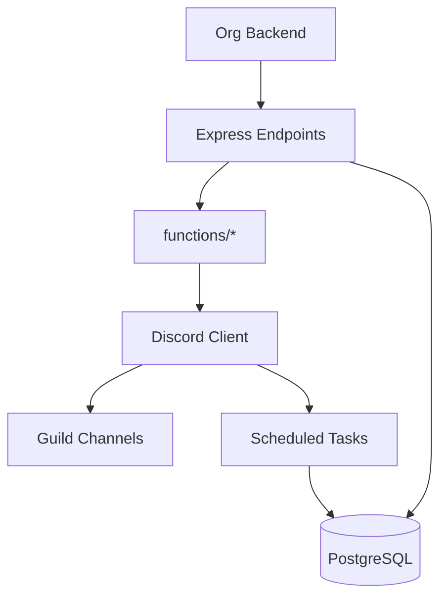

# Beowulf Discord Bot
Data-driven Discord automation for Star Citizen org operations: hit tracking, fleets/schedules, leaderboards, awards, and market insights.

## Overview
Beowulf combines deterministic data pipelines (UEX market data, stats, schedules) with Discord automation. It offers HTTP endpoints for backend-triggered events plus scheduled background jobs — no slash-commands or conversational handlers remain in this build.

### Quick Start
1) Create a `.env` from `ENVIRONMENT.md` (or a future `.env.example`).
2) Install dependencies and bootstrap folders (logs, chatlogs created via postinstall).
3) Run in test mode (default) or set `LIVE_ENVIRONMENT=true` for production.

```bash
npm install
npm run start
```

For process supervision in production, see `docs/OPERATIONS.md` (PM2 recommended).

### Clearing legacy slash commands (temporary helper)
If Discord still shows outdated slash commands from previous versions, run the purge helper. It deletes both global and guild-scoped commands for live/test apps based on your `.env` values.

```bash
npm run clear:commands               # uses .env by default
npm run clear:commands -- path/to/.env.other   # optional alt env file
```

Run it once after redeploying the GPT-free build, or anytime stray commands linger.

### Deploying the new slash commands
`/knowledge-doc-ingest` uploads plain-text or markdown docs into `knowledge_docs` with automatic chunking and (optional) embeddings. Deploy it after updating the command definitions:

```bash
npm run deploy:commands               # registers guild commands using .env
npm run deploy:commands -- path/to/.env.other
```

Grant upload access by setting `DOC_INGEST_ROLE_IDS` (and test equivalent) with the curator roles that should see and run the command.

Uploaded chunks are now searchable in every ChatGPT response pass: the assistant queries both the legacy `/api/knowledge` table and the new `knowledge_docs` vector index for each message. Tune the retrieval knobs with `CHATGPT_KNOWLEDGE_DOC_LOOKUP`, `CHATGPT_KNOWLEDGE_DOC_LIMIT`, `CHATGPT_KNOWLEDGE_DOC_MIN_SCORE`, plus the fallback scanners `CHATGPT_KNOWLEDGE_DOC_SCAN_LIMIT` / `CHATGPT_KNOWLEDGE_DOC_SCAN_PAGE` to adjust how aggressively those snippets show up alongside market data, memories, and other caches.

`/player-item-upload` bulk loads FPS item rows (CSV only) into the `items_fps` table via the REST API. Rows only need `name`, `category`, and `type`; the uploader auto-generates stable numeric IDs and stuffs every other column into the `stats` JSON payload so wildly different item schemas still work. Names are treated as the natural key, so rerunning a row with the same `name` updates the existing record instead of creating duplicates. Every successful upload also upserts a matching `game_entities` row so the chat entity index stays synchronized. Configure curator access with `PLAYER_ITEM_UPLOAD_ROLE_IDS` / `TEST_PLAYER_ITEM_UPLOAD_ROLE_IDS`, and tune file/row limits with `PLAYER_ITEM_UPLOAD_MAX_FILE_BYTES` + `PLAYER_ITEM_UPLOAD_MAX_ROWS`.

`/component-item-upload` is the same pipeline but targets the `items_components` table. CSV uploads only need a `name` column, the uploader fabricates IDs when omitted, and every extra column becomes part of `stats`. Duplicate `name` values automatically overwrite the existing component row rather than spawning new entries. These uploads also refresh the corresponding `game_entities` entries (no duplicate creation) to keep the search index current. Control access with `COMPONENT_ITEM_UPLOAD_ROLE_IDS` / `TEST_COMPONENT_ITEM_UPLOAD_ROLE_IDS` and size caps via `COMPONENT_ITEM_UPLOAD_MAX_FILE_BYTES` + `COMPONENT_ITEM_UPLOAD_MAX_ROWS`.

`/ship-list-upload` ingests curated ship specs into the `ship_list` table, capturing manufacturer/role/size metadata plus arbitrary stat columns while auto-generating IDs as needed. Like the other uploaders, `name` is the unique key, so re-uploading the same hull updates the existing row. Just like the other uploaders, every row also mirrors into `game_entities`, so Beowulf immediately recognizes the new hull names. Lock it down with `SHIP_LIST_UPLOAD_ROLE_IDS` / `TEST_SHIP_LIST_UPLOAD_ROLE_IDS`, and adjust caps using `SHIP_LIST_UPLOAD_MAX_FILE_BYTES` + `SHIP_LIST_UPLOAD_MAX_ROWS`.

`/ship-list-upload` ingests curated ship specs into the `ship_list` table, capturing manufacturer/role/size metadata plus arbitrary stat columns while auto-generating IDs as needed. Just like the other uploaders, every row also mirrors into `game_entities`, so Beowulf immediately recognizes the new hull names. Lock it down with `SHIP_LIST_UPLOAD_ROLE_IDS` / `TEST_SHIP_LIST_UPLOAD_ROLE_IDS`, and adjust caps using `SHIP_LIST_UPLOAD_MAX_FILE_BYTES` + `SHIP_LIST_UPLOAD_MAX_ROWS`.

`/rco-mining-upload` accepts JSON attachments (or inline JSON blocks) and pipes them directly into the `rco_mining_data` table. Each object can omit most columns — only `source_file` and `stat_grain` are mandatory for new rows — and updates are as simple as including an `id` plus the fields to patch. The uploader automatically recognizes the four schema variations produced by the RCO mining exporter (rock-type-by-location, ore-by-location, hand-mining finds, and rock-type-by-system) and flattens them into the canonical columns. When you provide raw row JSON instead, the optional `stat_grain` argument sets the default grain name so you don't have to repeat it per row. The uploader enforces JSON-specific file caps, surfaces row-level validation errors, and batches the individual create/update calls against the new `API_RCO_MINING_DATA_ROUTES` REST endpoint. Gate access with `RCO_MINING_UPLOAD_ROLE_IDS` / `TEST_RCO_MINING_UPLOAD_ROLE_IDS`, and tweak payload limits via `RCO_MINING_UPLOAD_MAX_FILE_BYTES` + `RCO_MINING_UPLOAD_MAX_ROWS`.

### Architecture snapshot


## Hit Tracker features

- Hits are created through the backend API (`/hittrackcreate`) or automation jobs instead of slash commands.
- Edits and deletions are likewise triggered via API payloads (`/hittrackdelete`) and reflected in Discord threads.
- When a hit arrives, the bot posts crew prompts so you can @mention assists or reply "none" directly in the thread.
- Deleting a hit removes the database record but leaves a red embed in the thread for historical context.

On deletion, the bot removes the database record but posts a red embed in the thread stating the hit was removed; the thread remains for history.


## Documentation Index
- `docs/ARCHITECTURE.md` – System overview, diagrams, modules
- `docs/ENVIRONMENT.md` – All environment variables by domain
- `docs/API.md` – Express HTTP endpoints + OpenAPI draft
- `docs/SCHEDULES-JOBS.md` – All recurring jobs, cadences, dependencies
- `docs/DATA-FLOWS.md` – End-to-end data lifecycles
- `docs/VECTOR-INGEST.md` – Embedding & vector store pipelines
- `docs/OPERATIONS.md` – Runbook: start/stop, PM2, recovery
- `docs/SECURITY.md` – Tokens, permissions, privacy
- `docs/TROUBLESHOOTING.md` – Common issues and fixes
- `docs/CONTRIBUTING.md` – Conventions & contribution guide
- `docs/market-data.md` – Detailed market cache and answerers (existing)

## Contributing
See `docs/CONTRIBUTING.md` for coding standards, branching, and PR guidance.

