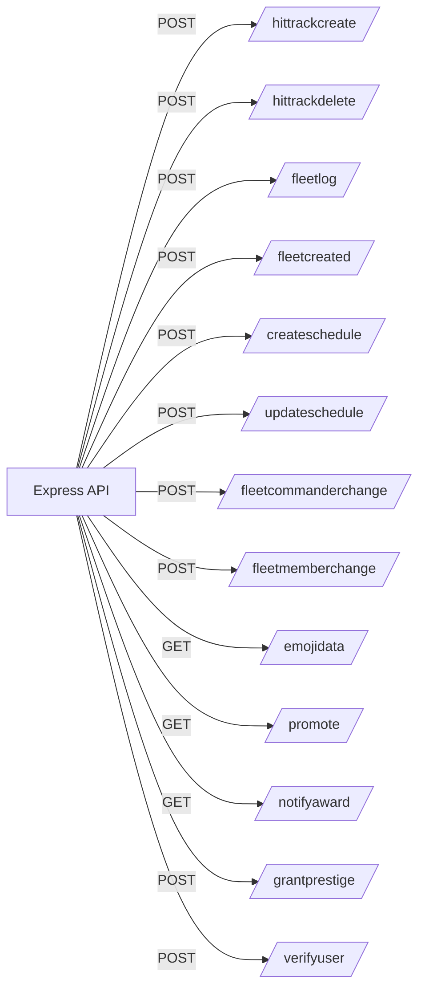

# HTTP API Reference

This file documents the Express endpoints exposed by the bot (see `index.js`). Endpoints are intended for internal platform services; protect them behind network controls and ensure request validation upstream.

## Base URL
- Host/Port: `http://<host>:<BOT_HTTP_PORT>`
- Content-Type: JSON unless noted.

## Endpoints

### POST /hittrackcreate
- Purpose: Create a new HitTrack entry; posts Discord message/embed to Hit forum.
- Body: HitTrack object (schema managed by `functions/post-new-hit.js`).
- Responses:
  - 200: `{ message: 'HitTrack received by Discord bot.' }`
  - 500: `{ error: 'Failed to process HitTrack.' }`

### POST /hittrackdelete
- Purpose: Delete an existing hit; updates Discord thread title and posts removal embed.
- Body: `{ hit: {...}, deleted_by?, deleted_by_username?, deleted_by_nickname? }` or the hit object directly.
- Responses:
  - 200: `{ message: 'HitTrackdelete processed.' }`
  - 500: `{ error: 'Failed to process HitTrackdelete.' }`

### POST /fleetlog
- Purpose: Post a new ship/fleet log entry to Discord.
- Body: ShipLog object.
- Responses: 200/500 similar to above.

### POST /fleetcreated
- Purpose: Notify about new Fleet creation.
- Body: Fleet object.
- Responses: 200/500 similar to above.

### POST /createschedule
- Purpose: Create a schedule/event and post Discord embeds with RSVP.
- Body: Schedule object (includes RSVP options and visibility roles).
- Responses: 200/500 similar to above.

### POST /updateschedule
- Purpose: Update a schedule/event (RSVP tallies, time, options) and update Discord message.
- Body: Schedule object.
- Responses: 200/500 similar to above.

### POST /fleetcommanderchange
- Purpose: Notify when a fleet commander assignment changes.
- Body: Fleet object or change payload.
- Responses: 200/500 similar to above.

### POST /fleetmemberchange
- Purpose: Notify when fleet membership changes.
- Body: Fleet object or change payload.
- Responses: 200/500 similar to above.

### GET /emojidata
- Purpose: Enumerate all emojis across connected guilds (admin/op tooling).
- Response: `[{ id, name, url, animated, guild }]`

### GET /promote
- Purpose: Manually trigger promotion notification for a user.
- Query: `user_id`
- Responses:
  - 200: "TRUE" (promotion notification sent)
  - 400/500: error message

### GET /notifyaward
- Purpose: Trigger an award notification for a user.
- Query or Body: `badgeName`, `badgeDescription`, `userName`, `userId`
- Responses: 200: "TRUE" or 400/500 error

### POST /grantprestige
- Purpose: Grant prestige level to a user and notify.
- Body: `{ user_id, prestige_name, prestige_level }`
- Responses: 200: "TRUE" or 400/500 error

### POST /verifyuser
- Purpose: Submit RSI handle + Discord user ID for verification.
- Body: `{ handle, userId }`
- Responses:
  - 200: `{ message: 'Success! ...' }`
  - 400: `{ error: '...' }`

## Authentication & Authorization
- The service trusts upstream caller; ensure calls originate from your backend with proper authentication.
- Recommended: Place behind an API gateway or internal network; add HMAC or bearer token check at this layer (future improvement).

## OpenAPI (Draft Stub)
```yaml
openapi: 3.0.3
info:
  title: Beowulf Bot API
  version: 0.1.0
servers:
  - url: http://localhost:{port}
    variables:
      port:
        default: '3000'
paths:
  /hittrackcreate:
    post:
      summary: Create HitTrack
      requestBody:
        required: true
        content:
          application/json:
            schema:
              type: object
              additionalProperties: true
      responses:
        '200': { description: OK }
        '500': { description: Error }
  /hittrackdelete:
    post:
      summary: Delete HitTrack
      requestBody:
        required: true
        content:
          application/json:
            schema:
              type: object
              additionalProperties: true
      responses:
        '200': { description: OK }
        '500': { description: Error }
  /fleetlog:
    post:
      summary: Create Fleet Log
      responses:
        '200': { description: OK }
  /fleetcreated:
    post:
      summary: Fleet Created
      responses:
        '200': { description: OK }
  /createschedule:
    post:
      summary: Create Schedule
      responses:
        '200': { description: OK }
  /updateschedule:
    post:
      summary: Update Schedule
      responses:
        '200': { description: OK }
  /fleetcommanderchange:
    post:
      summary: Fleet Commander Change
      responses:
        '200': { description: OK }
  /fleetmemberchange:
    post:
      summary: Fleet Member Change
      responses:
        '200': { description: OK }
  /emojidata:
    get:
      summary: Emoji Data
      responses:
        '200':
          description: Emoji list
          content:
            application/json:
              schema:
                type: array
                items:
                  type: object
  /promote:
    get:
      summary: Promote user notification
      parameters:
        - name: user_id
          in: query
          required: true
          schema:
            type: string
      responses:
        '200': { description: OK }
  /notifyaward:
    get:
      summary: Notify award
      parameters:
        - name: badgeName
          in: query
          schema: { type: string }
        - name: badgeDescription
          in: query
          schema: { type: string }
        - name: userName
          in: query
          schema: { type: string }
        - name: userId
          in: query
          schema: { type: string }
      responses:
        '200': { description: OK }
  /grantprestige:
    post:
      summary: Grant prestige
      requestBody:
        required: true
        content:
          application/json:
            schema:
              type: object
              properties:
                user_id: { type: string }
                prestige_name: { type: string }
                prestige_level: { type: integer }
      responses:
        '200': { description: OK }
  /verifyuser:
    post:
      summary: Verify user
      requestBody:
        required: true
        content:
          application/json:
            schema:
              type: object
              properties:
                handle: { type: string }
                userId: { type: string }
      responses:
        '200': { description: OK }
```

## Mermaid: Endpoint Map


## Notes
- Payload schemas are defined in the respective handler modules under `functions/` and `api/`; keep this document updated as those evolve.
