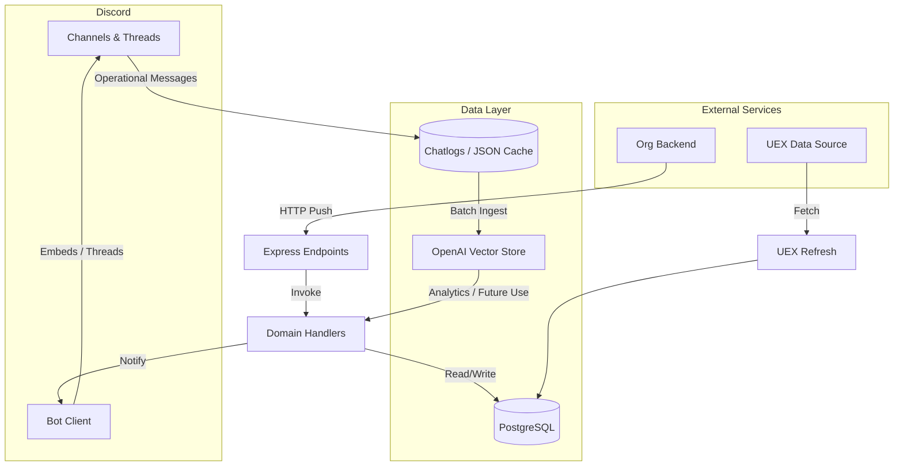
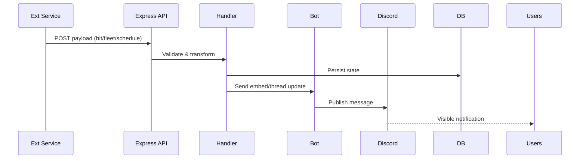

# Architecture Overview

This document provides a high-level view of the Beowulf Discord bot system: major subsystems, data flows, and integration points.

## High-Level Goals
- Automate Discord notifications and data sync for org operations (hits, fleets, schedules, leaderboards, awards).
- Maintain in-game/org data pipelines with deterministic processing and scheduled refreshes.
- Capture conversational and operational data for analytics (vector storage still maintained even without live GPT responses).
- Offer HTTP endpoints for external services to push events (hit creation, fleet updates, awards).
- Operate reliably across live/test environments with isolated configuration.

## Subsystems
1. Discord Client Core: Initialization, event listeners, and scheduled job orchestration.
2. Automation Jobs: Timed tasks for UEX refresh, awards, leaderboards, cache refresh, and knowledge ingestion.
3. Vector Knowledge & Embeddings: Chat, hit logs, player stats ingestion using OpenAI embeddings (retained for analytics/search even though no conversational handler consumes it live).
4. Scheduling & Events: Creation/update of events with RSVP buttons, periodic management (`functions/create-new-schedule.js`, `functions/update-schedule.js`, `common/event-management.js`).
5. Leaderboards & Awards: Processing logs and stats for automated awards (`functions/process-leaderboards.js`, `common/automated-awards.js`).
6. User Verification & Role Sync: Mapping Discord roles to rank/prestige tiers (`userlist-functions/userlist-controller.js` + verification flows).
7. Express HTTP API: Endpoints for external triggers integrated into the Discord channel ecosystem.
8. Persistence & Caching: PostgreSQL (via `pg` & `db/pool.js`), in-memory Maps, temporary lock files, file-based chat logs.
9. Environment & Configuration: Extensive `process.env` usage grouped in `ENVIRONMENT.md`.

## Mermaid: System Context Diagram

## Data Flow Summary
1. Startup:
  - Load environment, acquire single-instance lock.
  - Prime channels, preload DB tables, refresh userlist, optionally run UEX refresh.
  - Skip legacy chatgpt cache warmup (removed) but continue batch ingestion flags if enabled.
2. Runtime:
  - Discord events handle membership changes, button interactions, and ingestion-only message logging (no conversational replies).
  - Message ingestion (live) still pushes to vector embeddings if enabled for downstream analytics.
  - Scheduled intervals recalculate leaderboards, awards, user stats, and market data.
  - External systems POST new hits, fleets, schedules; bot posts formatted embeds/threads.

## Key Modules & Responsibilities
| Module | Responsibility |
|--------|----------------|
| `index.js` | Orchestrates startup, intervals, Discord event binding, Express API. |
| `common/process-uex-data.js` | Refreshes market DB tables from UEX. |
| `vector-handling/*` | Chat/hits/player stats ingestion & vector store management. |
| `userlist-functions/userlist-controller.js` | Role-to-rank + prestige level calculations. |
| `functions/*` | Domain-specific event & state mutation handlers (hits, fleets, schedules). |
| `common/automated-awards.js` | Automated awards evaluation and notifications. |
| `common/event-management.js` | Event lifecycle & RSVP state updates. |
| `api/*` | API wrappers for database CRUD and external sources. |

## Retrieval & Embedding Strategy
- Embedding model: configurable via `EMBEDDING_MODEL` (default 'text-embedding-3-small').
- Vector Store segmentation: chat summaries, hit logs, player stat snapshots.
- Live ingestion vs batch startup ingestion controlled by feature flags.
- Pruning strategy: max retained vector items via `CHAT_VECTOR_MAX`; additional retention (DAYS_OLD) planned.

## Concurrency & Guards
- Single-instance lock (temp file) prevents duplicate processes on same host.
- UEX refresh sequence protected by `uexRefreshInProgress` flag.
- Vector ingestion uses bounded concurrency (`INGEST_CONCURRENCY`).

## Failure Modes & Resilience
- All intervals wrap operations in try/catch; failures only log without escalation.
- Missing or stale data served until next successful cycle (e.g., market caches).
- Recommended improvements: structured logging, health endpoint, backoff for high-frequency tasks.

## Security Considerations
- Discord & OpenAI tokens in environment only.
- External POST endpoints should be network-restricted; currently lack auth tokens.
- Role gating ensures certain actions reserved for moderator/admin (award revocation, manual replacements).

## Extensibility Guidelines
- Add new scheduled tasks: implement function and register setInterval in a dedicated scheduler module (future). Document in SCHEDULES-JOBS.md.
- Add new ingestion source: create ingest function in `vector-handling/` and integrate with flags.
- Introduce new data domain: define API in `api/`, caching in `common/`, handlers in `functions/`.

## Mermaid: Event & API Lifecycle

## Pending / Legacy Components
- Deprecated modules under `deprecated-but-keep/` retained for reference; avoid extending.
- Queue controller & progression editing logic currently disabled.
- Potential resurrection: chat log trimming and recent fleets management.

## Roadmap (Suggested)
1. Centralized Scheduler registry & status reporting.
2. Authentication layer for HTTP POST endpoints.
3. Environment validation loader with typed schema.
4. Enhanced retrieval ranking using hybrid search (vector + keyword). 
5. Role-based analytics dashboard (web UI) summarizing leaderboards & award history.

