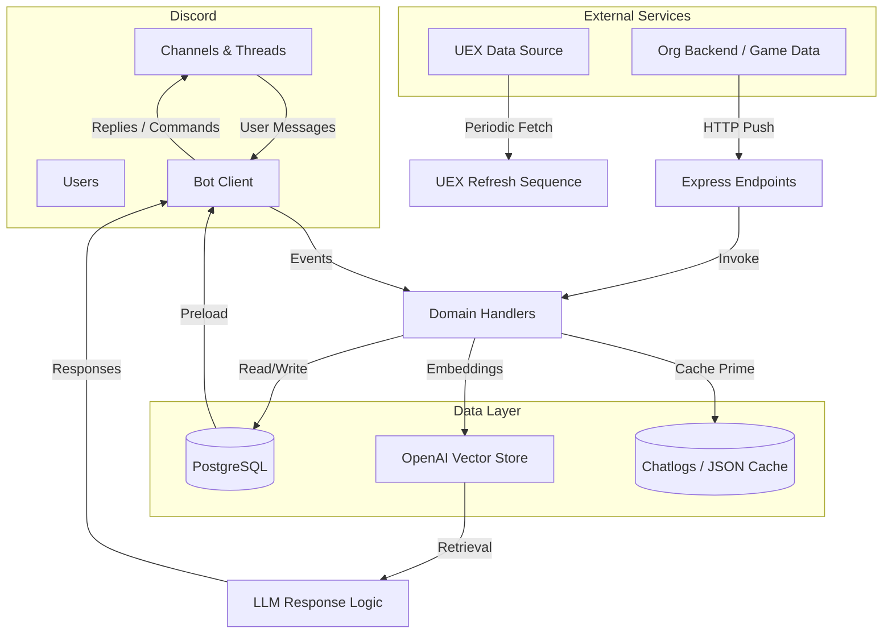
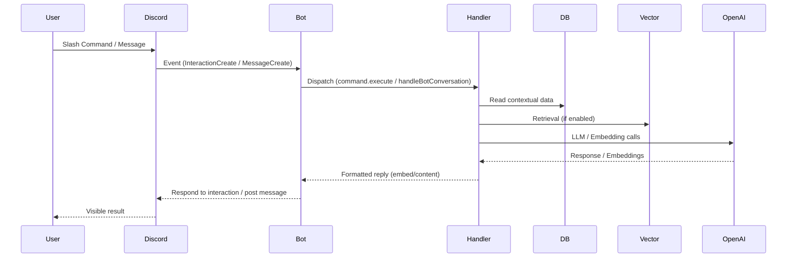

# Architecture Overview

This document provides a high-level view of the Beowulf Discord bot system: major subsystems, data flows, and integration points.

## High-Level Goals
- Provide intelligent, context-aware Discord interactions (commands, conversational replies).
- Maintain in-game/org data (hits, fleets, schedules, leaderboards, awards) with automated processing.
- Ingest conversational and operational data into vector knowledge for retrieval-augmented responses.
- Offer HTTP endpoints for external services to push events (hit creation, fleet updates, awards).
- Operate reliably across live/test environments with isolated configuration.

## Subsystems
1. Discord Client Core: Initialization, event listeners, command loader.
2. Command Framework: Dynamic discovery of slash command modules from `commands/`.
3. Conversation Handling: Mention/reply detection routing into `chatgpt/handler.js` and legacy thread-based responders.
4. Market & Location Data: Periodic UEX ingestion + in-memory caching for trade/route advice, found under `common/process-uex-data.js` and `chatgpt/market-answerer.js`.
5. Vector Knowledge & Embeddings: Chat, hit logs, player stats ingestion using OpenAI embeddings and vector store operations in `vector-handling/`.
6. Scheduling & Events: Creation/update of events with RSVP buttons, periodic management (
`functions/create-new-schedule.js`, `functions/update-schedule.js`, `common/event-management.js`).
7. Leaderboards & Awards: Processing logs and stats for automated awards (`functions/process-leaderboards.js`, `common/automated-awards.js`).
8. User Verification & Role Sync: Mapping Discord roles to rank/prestige tiers (`userlist-functions/userlist-controller.js` + verification flows).
9. Express HTTP API: Endpoints for external triggers integrated into the Discord channel ecosystem.
10. Persistence & Caching: PostgreSQL (via `pg` & `db/pool.js`), in-memory Maps, temporary lock files, file-based chat logs.
11. Environment & Configuration: Extensive `process.env` usage grouped in `ENVIRONMENT.md`.

## Mermaid: System Context Diagram

## Data Flow Summary
1. Startup:
   - Load environment, acquire single-instance lock.
   - Prime channels, preload DB tables, refresh userlist, optionally run UEX refresh.
   - Warm caches (systems, stations, planets, outposts, terminals, market data).
   - Optionally batch-ingest historical chat to vector store.
2. Runtime:
   - Discord events trigger command handlers or conversation routing.
   - Message ingestion (live) pushes to vector embeddings if enabled.
   - Scheduled intervals recalculate leaderboards, awards, user stats, and market data.
   - External systems POST new hits, fleets, schedules; bot posts formatted embeds/threads.
   - Retrieval pipeline uses vector + fallback heuristics to enrich LLM responses.

## Key Modules & Responsibilities
| Module | Responsibility |
|--------|----------------|
| `index.js` | Orchestrates startup, intervals, Discord event binding, Express API. |
| `chatgpt/handler.js` | Core message interpretation, routing, retrieval, AI generation. |
| `commands/*` | Slash command definitions (`data` + `execute`). |
| `common/process-uex-data.js` | Refreshes market DB tables from UEX. |
| `chatgpt/market-answerer.js` | Deterministic trade/location advice functions. |
| `vector-handling/*` | Chat/hits/player stats ingestion & vector store management. |
| `userlist-functions/userlist-controller.js` | Role-to-rank + prestige level calculations. |
| `functions/*` | Domain-specific event & state mutation handlers (hits, fleets, schedules). |
| `common/automated-awards.js` | Automated awards evaluation and notifications. |
| `common/event-management.js` | Event lifecycle & RSVP state updates. |
| `api/*` | API wrappers for database CRUD and external sources. |

## Retrieval & Embedding Strategy
- Embedding model: configurable via `EMBEDDING_MODEL` (default 'text-embedding-3-small').
- Vector Store segmentation: chat summaries, hit logs, player stat snapshots.
- Live ingestion vs batch startup ingestion controlled by feature flags.
- Pruning strategy: max retained vector items via `CHAT_VECTOR_MAX`; additional retention (DAYS_OLD) planned.

## Concurrency & Guards
- Single-instance lock (temp file) prevents duplicate processes on same host.
- UEX refresh sequence protected by `uexRefreshInProgress` flag.
- Vector ingestion uses bounded concurrency (`INGEST_CONCURRENCY`).

## Failure Modes & Resilience
- All intervals wrap operations in try/catch; failures only log without escalation.
- Missing or stale data served until next successful cycle (e.g., market caches).
- Recommended improvements: structured logging, health endpoint, backoff for high-frequency tasks.

## Security Considerations
- Discord & OpenAI tokens in environment only.
- External POST endpoints should be network-restricted; currently lack auth tokens.
- Role gating ensures certain actions reserved for moderator/admin (award revocation, manual replacements).

## Extensibility Guidelines
- Add new scheduled tasks: implement function and register setInterval in a dedicated scheduler module (future). Document in SCHEDULES-JOBS.md.
- Add new command: place in `commands/<group>/<name>.js` exporting `data` (SlashCommandBuilder) and `execute`.
- Add new ingestion source: create ingest function in `vector-handling/` and integrate with flags.
- Introduce new data domain: define API in `api/`, caching in `common/`, handlers in `functions/`.

## Mermaid: Command Lifecycle

## Pending / Legacy Components
- Deprecated modules under `deprecated-but-keep/` retained for reference; avoid extending.
- Queue controller & progression editing logic currently disabled.
- Potential resurrection: chat log trimming and recent fleets management.

## Roadmap (Suggested)
1. Centralized Scheduler registry & status reporting.
2. Authentication layer for HTTP POST endpoints.
3. Environment validation loader with typed schema.
4. Enhanced retrieval ranking using hybrid search (vector + keyword). 
5. Role-based analytics dashboard (web UI) summarizing leaderboards & award history.

