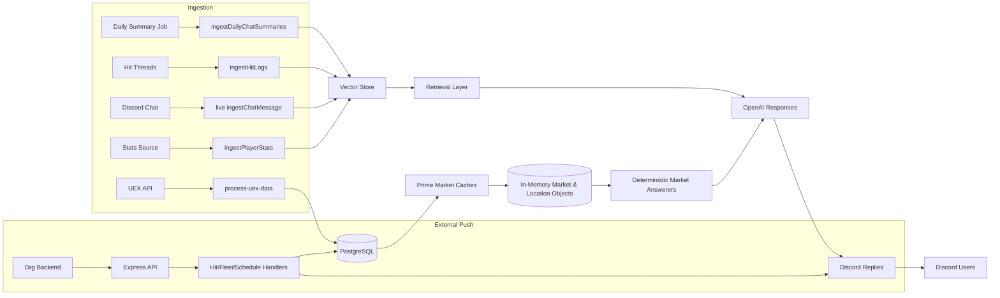
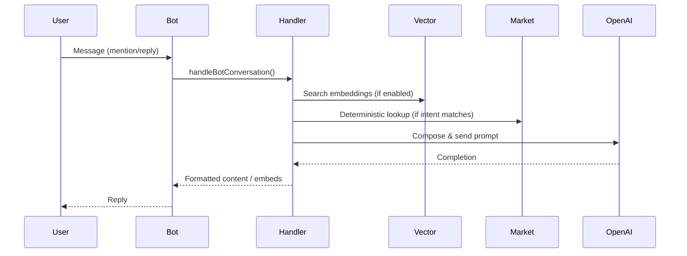

# Data Flows

This document maps the main data lifecycles: market/location data, hits & fleets, schedules/events, chat & knowledge vectors, leaderboards, awards, and user verification.

## Overview Mermaid Diagram

## Market / Location Data Flow
1. Trigger: Startup (cache warm) or scheduled 24h sequence.
2. `process-uex-data.js` fetches categories sequentially: terminal_prices, items_by_terminal, other_tables.
3. Data persisted into DB tables via UEX API helpers.
4. Cache Prime: `primeMarketCache` loads markets & systems into in-memory structures.
5. Answerers (`chatgpt/market-answerer.js`) read `state.data` and compose deterministic responses.
6. Users query via tool-agent or direct prompts; output may augment LLM answers.

### Accuracy & Freshness
- Sequence ensures old data replaced after full category cycle; partial failure leaves stale entries.
- Consider adding timestamp metadata per dataset for monitoring.

## Hit Logs Flow
1. Creation: User natural language or `/hit-tracker-add` produces hit thread & DB record.
2. Updates/Deletes: Natural language or slash command; modification events logged and optionally ingested.
3. Ingestion: `ingestHitLogs` (6h) transforms historical hit content to embeddings.
4. Retrieval: Vector search surfaces relevant hits for advice or historical reference.

## Fleet & Schedule Flow
- Fleets created/updated via external POST or command produce notifications & embeds.
- Commander/member changes propagate to specialized channels.
- Schedules generate RSVP messages; button interactions modify DB schedule state via `handleScheduleUpdate`.
- Event management job reconciles stale events.

## Chat & Knowledge Vector Flow
1. Live ingestion (optional): Each `messageCreate` triggers non-blocking embedding of message payload.
2. Daily summaries: Aggregates chat sentiment/summary lines then embeds (`ingestDailyChatSummaries`).
3. Pruning: Max retention limit (`CHAT_VECTOR_MAX`) culls oldest entries; planned age-based pruning.
4. Retrieval: Query builder chooses vector vs fallback depending on flags (`KNOWLEDGE_PREFER_VECTOR`).

### Embedding Strategy
- Model: `EMBEDDING_MODEL` (default 'text-embedding-3-small').
- Concurrency: Bounded by `INGEST_CONCURRENCY` (1–8).
- Storage: OpenAI Vector Store keyed by file ingestion segments.

## Player Stats Flow
1. Source: External stats table or API aggregated into DB.
2. Ingestion: `ingestPlayerStats` (1h) encodes snapshots for retrieval.
3. Leaderboards: `processPlayerLeaderboards` (4h) calculates scoring metrics.
4. Awards: `automatedAwards` (1h) evaluates achievements, calls `notifyForAward` / potential prestige grant.

## User Verification & Role Sync Flow
1. Verification: POST `/verifyuser` with RSI handle + Discord ID; system validates and returns success/failure.
2. Role Updates: `guildMemberUpdate` triggers rank recalculation via `userlist-controller.js`.
3. Prestige Levels: Computed from role sets (RAPTOR/CORSAIR/RAIDER tiers) updated in DB (`editUser`).
4. Promotion & Awards: Endpoint `/promote` or automated job uses `promotePlayerNotify` & award handlers.

## Retrieval Augmentation Flow
1. User mentions/replies to bot.
2. `handler.js` gathers context (recent messages, user state, vector retrieval results, market answers if needed).
3. LLM prompt assembled using persona (`BOT_INSTRUCTIONS`) + retrieved documents.
4. Response: Sent to thread/channel; optional fallback pathway if new handler fails.

## Mermaid: LLM Augmented Response

## Data Integrity & Consistency
- Most domain writes originate from single handlers to prevent divergence.
- Live ingestion is append-only; pruning must ensure index consistency (OpenAI vector store manages underlying indices).
- Potential improvement: Add checksum or versioning to market dataset loads.

## Error Handling Patterns
| Flow | Error Mode | Current Behavior | Recommended Improvement |
|------|------------|------------------|-------------------------|
| UEX Refresh | API failure mid-sequence | Logs error; partial load | Transactional staging then swap |
| Live Chat Ingest | Embedding quota exceeded | Logs error silently | Backoff & queue retry |
| Vector Pruning | Deletion collision | Rare (OpenAI handles) | Maintain local ledger of file IDs |
| Leaderboard Calc | Missing stats table | Logs & skips | Fallback to last known leaderboard |
| Award Grant | Discord permission error | Logs only | Alert admin audit channel |

## Performance Considerations
- Embedding concurrency tuned (default 2) to balance throughput vs rate limits.
- Market answerers rely on in-memory maps to avoid DB latency; refresh is batch oriented.
- Intervals spaced to reduce overlapping heavy tasks (UEX refresh vs player stat ingest).

## Suggested Enhancements
1. Implement async job registry with last-run metadata & success flag for `/health`.
2. Introduce partial index building for large vector updates to reduce blocking.
3. Add structured JSON logging for ingestion batches (counts, durations, error codes).
4. Consider local semantic cache for frequent retrieval queries to lower OpenAI vector calls.
5. Expand verification to multi-step (captcha or handle format validation) for abuse mitigation.

