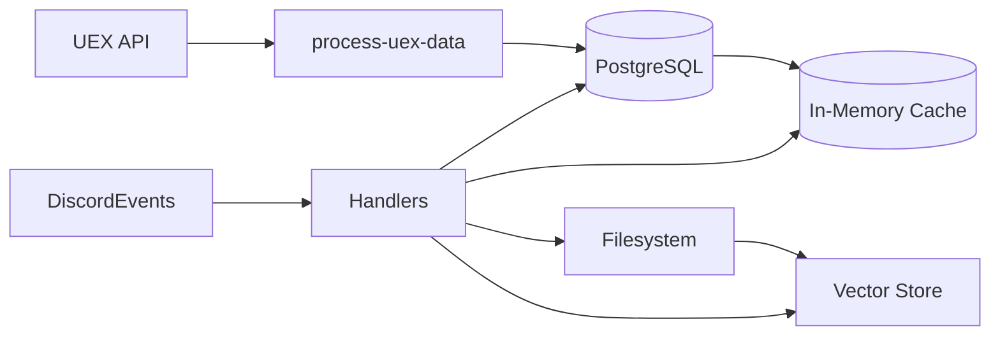

# Data Storage Layers

This document details the persistence and caching mechanisms used by the bot.

## Components
| Layer | Technology | Purpose |
|-------|------------|---------|
| Relational DB | PostgreSQL (`pg`) | Core domain records: hits, fleets, schedules, market tables, user stats, leaderboards. |
| In-Memory Cache | JS Maps / Objects | Fast lookup for channels, users, market data, preloaded tables. |
| Vector Store | OpenAI Managed | Embedding-based semantic retrieval (chat, hits, stats). |
| File System | `chatlogs/`, `logs/`, temp dir | Raw chat log archiving (legacy), runtime logs, single-instance lock file. |
| External APIs | UEX, Org Backend | Source data for market and operational events. |

## PostgreSQL
- Connection pool: `db/pool.js` handles credentials (env variables not enumerated here—add if present).
- Market tables loaded via `process-uex-data.js` and later read into memory caches.
- Leaderboard/stat tables periodically recalculated.
- Consider adding migrations (currently not documented). Future: integrate a tool like `node-pg-migrate`.

## In-Memory Data Structures
- `channelIds`, `channelIdAndName` – Channel access control and mapping.
- `userCache` (Map) – Cached user role/rank info refreshed every 12 hours.
- Market cache: Complex nested arrays/maps in `chatgpt/data-cache.js` (see `market-data.md`).
- Preloaded DB tables: `preloadedDbTables` for contextual message handling.

## Vector Store
- Embedding files representing multiple sources.
- Operations: list, delete, create files (chat logs, summaries, hits, stats).
- Retention managed by custom pruning logic (`CHAT_VECTOR_MAX`).
- Improvement: Add metadata indexing for age/source segmentation.

## File System Artifacts
- Lock file: `beowulf-bot-<live|test>.lock` in OS temp directory prevents concurrent runs.
- Chat logs (legacy): Append raw chat; ingestion now favors vector pipeline.
- Logs: Created via `postinstall`; ensure log rotation externally.

## Mermaid: Storage Interaction

## Consistency Model
- Eventual consistency between DB and caches; periodic refresh updates memory snapshots.
- Vector store independent of relational state (can temporarily diverge).
- Hit/fleet operations update DB first; Discord posts reflect committed state.

## Backup & Recovery (Suggested)
1. Schedule nightly SQL dumps.
2. Version `data/*.json` seed files for market bootstrap.
3. Maintain vector export process (not implemented) to rebuild store quickly after loss.

## Integrity & Validation
- Minimal runtime schema validation; rely on upstream correctness.
- Recommendation: Introduce validation layer (e.g., Zod schemas) for incoming API payloads before DB insertion.

## Security Considerations
- Restrict DB credentials scope (read/write limited to required schemas).
- Ensure file system logs/chatlogs don’t store sensitive data beyond retention policy.

## Future Enhancements
- Add cache metrics (hit/miss) and expose via health endpoint.
- Implement a delta refresh for market data instead of full reload.
- Provide admin command to dump current cache summary.

