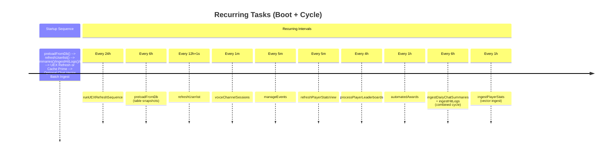
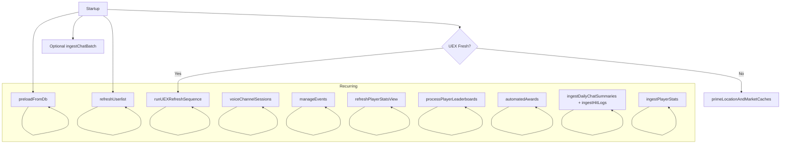

# Scheduled Jobs & Intervals

This document enumerates all recurring tasks defined in `index.js` (and related ingest modules). Each interval includes: purpose, cadence, dependencies, failure considerations, and restart behavior.

## Overview Diagram (Mermaid)

> Note: Some commented-out intervals (chat log loading, trimming, recent fleets) are disabled but retained for future restoration.

## Job Table
| Function | Cadence | Location | Purpose | Depends On | Failure Handling |
|----------|---------|----------|---------|------------|------------------|
| `runUEXRefreshSequence` | 24h | index.js | Refresh UEX market data tables sequentially then prime in-memory caches | External UEX API, DB | Logs error; sets flag to prevent overlap |
| `preloadFromDb` | 6h | index.js | Refresh preloaded DB tables snapshot used for message handling/context | DB connectivity | Errors logged; previous snapshot retained |
| `refreshUserlist` | 12h + 1s | index.js | Sync in-memory user cache & roles; keeps ranking info current | Discord API, DB | Logs error; continues with stale cache |
| `voiceChannelSessions` | 1m | index.js | Track active voice sessions for stats or awards | Discord voice state events | Errors logged unobtrusively |
| `manageEvents` | 5m | index.js | Update event RSVPs, time-based transitions, embed updates | Schedules DB/API | Logs error, next run recovers |
| `refreshPlayerStatsView` | 5m | index.js | Regenerate player stats aggregate view | Player stats DB | Errors logged, next run retries |
| `processPlayerLeaderboards` | 4h | index.js | Compute or refresh leaderboards (player/org) | Hit logs, stats tables | Logs error, no retry until next interval |
| `automatedAwards` | 1h | index.js | Evaluate and grant eligible awards | User activity data, leaderboard logs | Logs error, next cycle re-evaluates |
| `ingestDailyChatSummaries` + `ingestHitLogs` | 6h | index.js | Convert daily summaries & hit logs to embeddings (vector knowledge) | OpenAI API, vector store, DB | Catches combined errors; may skip both |
| `ingestPlayerStats` | 1h (configured; comment notes 6h alt) | index.js | Ingest player stats embeddings | Player stats DB, OpenAI API | Logs error; next run retries |
| `ingestChatBatch` (optional startup) | Once at boot (conditional) | index.js | Bulk ingest historical chat to vector store | Flag + OpenAI API | Error logged; can be manually re-triggered |

## Detailed Descriptions
### UEX Refresh Sequence (`runUEXRefreshSequence`)
1. Guard: `uexRefreshInProgress` prevents overlap.
2. Steps: `processUEXData('terminal_prices')`, `'items_by_terminal'`, `'other_tables'` sequentially.
3. On success: primes location & market caches (`primeMarketCache`, `loadSystems`, `loadStations`, `loadPlanets`, `loadOutposts`).
4. Failure: logs and clears in-progress flag; stale data remains served.
5. Trigger Conditions: On startup if `UEX_FRESH_LOAD_ON_START === 'true'`; otherwise only warms caches from existing DB.

### Preload DB Tables (`preloadFromDb`)
- Maintains `preloadedDbTables` used during message command parsing and contextual responses.
- Lightweight: safe to refresh while bot active.

### Userlist Refresh (`refreshUserlist`)
- Updates `userCache` and related ranking/prestige references.
- Slight offset (12h + 1s) reduces chance of alignment with other 12h tasks.

### Voice Channel Sessions (`voiceChannelSessions`)
- Polling approach rather than event-only to ensure missed transitions are captured.
- Potential Improvement: Switch to event-driven with fallback poll.

### Events Management (`manageEvents`)
- Reconciles RSVP states, updates embeds for schedules.
- Consumes schedule API / DB view.

### Player Stats View (`refreshPlayerStatsView`)
- Produces aggregated view for fast leaderboard or award checks.

### Leaderboards Processing (`processPlayerLeaderboards`, `processOrgLeaderboards`) 
- Periodic recalculation of ranking metrics and logs for prestige/awards.

### Automated Awards (`automatedAwards`)
- Evaluates criteria and sends notifications (via `notifyForAward`).
- Side Effect: May trigger `grantPrestigeNotify` depending on award logic.

### Embedding Ingest Cycles
- Daily Summaries & Hits: Combined into a single 6h interval for sequential ingestion and reduced API churn.
- Player Stats: Independent 1h cycle.
- Live Chat Ingest: Real-time via `ingestChatMessage` when `CHAT_VECTOR_INGEST_LIVE` enabled.
- Batch Startup Ingest: `ingestChatBatch` conditioned by both `KNOWLEDGE_INGEST_ENABLE` and `CHAT_VECTOR_INGEST_ON_START`.

## Failure & Resilience Notes
- All intervals wrap calls in try/catch; errors logged to console only.
- No circuit breaker / exponential backoff currently; repeated external failures (OpenAI, DB) will spam logs at smaller intervals (1m, 5m).
- Recommendation: Introduce a lightweight failure counter & degrade mode for noisy loops (e.g., voice sessions) after N consecutive errors.

## Observability Recommendations (Future)
- Centralize job success/failure metrics to a health channel or external dashboard.
- Add timestamps of last success to an internal status map exposed via `/health` endpoint.
- Use structured logging (JSON) for intervals to ease parsing.

## Suggested Improvements
1. Configurable cadences via environment variables (document in ENVIRONMENT.md once added).
2. Dedicated scheduler module exporting a registry array: `{ name, fn, intervalMs, enabledFlag }` for introspection.
3. Add jitter to long intervals (UEX refresh) to avoid synchronized external load across multiple deploys.
4. Provide manual trigger slash commands for critical refreshes (UEX, leaderboards, awards) gated by admin roles.

## Deprecated / Commented Intervals
- `loadChatlogs` (every 1m) – Disabled: replaced by vector ingestion pathways.
- `trimChatLogs` (every 12h) – Disabled: pruning logic possibly superseded by vector store retention.
- `manageRecentFleets` – Disabled: fleet tracking logic moved or paused.

## Mermaid Alternate View: Dependency Graph

## Quick Reference
| Cadence | Jobs |
|---------|------|
| 1 minute | voiceChannelSessions |
| 5 minutes | manageEvents, refreshPlayerStatsView |
| 1 hour | automatedAwards, ingestPlayerStats |
| 4 hours | processPlayerLeaderboards |
| 6 hours | preloadFromDb, ingestDailyChatSummaries + ingestHitLogs |
| 12 hours | refreshUserlist |
| 24 hours | runUEXRefreshSequence |
| Startup | Optional chat batch ingest, UEX cache prime |

