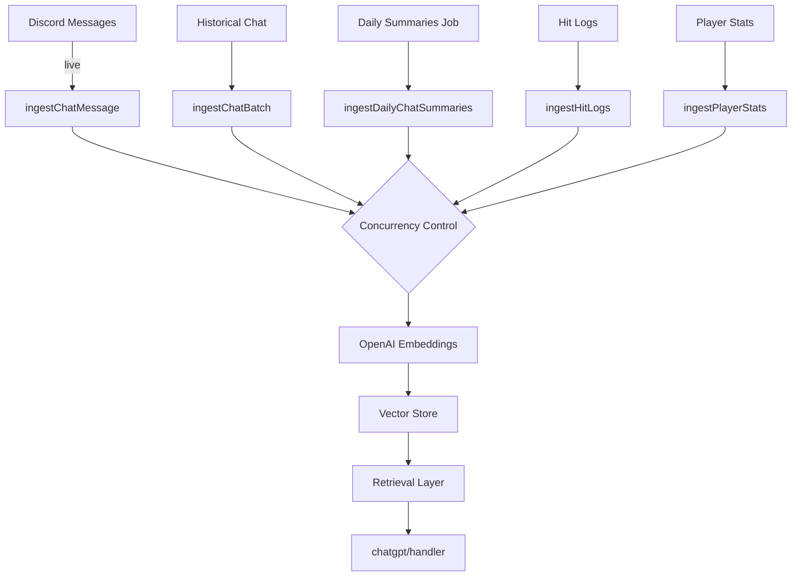

# Vector Ingestion & Retrieval

This document explains how conversational, operational, and statistical data become embeddings in the OpenAI vector store and how they are used during response generation.

## Goals
- Persist salient org knowledge (chat summaries, hits, player stats) for retrieval-augmented assistance.
- Balance freshness with cost via scheduled batch ingest + optional live streaming.
- Provide tunable controls (env flags) for enabling/disabling each source.

## Sources & Triggers
| Source | Module | Trigger | Flag |
|--------|--------|---------|------|
| Historical Chat Logs | `vector-handling/chat-ingest.js` | Optional startup batch | `KNOWLEDGE_INGEST_ENABLE` + `CHAT_VECTOR_INGEST_ON_START` |
| Live Messages | `index.js` (messageCreate -> ingestChatMessage) | Per qualifying message | `KNOWLEDGE_INGEST_ENABLE` + `CHAT_VECTOR_INGEST_LIVE` |
| Daily Chat Summaries | `vector-handling/extra-ingest.js` | 6h interval | `CHAT_SUMMARY_ENABLE` |
| Hit Logs | `vector-handling/extra-ingest.js` | 6h interval | `HIT_INGEST_ENABLE` |
| Player Stats Snapshots | `vector-handling/extra-ingest.js` | 1h interval | `PLAYER_STATS_INGEST_ENABLE` |

## Environment Variables
- `EMBEDDING_MODEL` – Embedding model name (default `text-embedding-3-small`).
- `INGEST_CONCURRENCY` – Parallel ingestion threads (default 2, range 1–8).
- `INGEST_MAX` – Cap on items processed in batch (0 = all).
- `CHAT_VECTOR_MAX` – Retention limit for chat embeddings (default 2000).
- Feature toggles listed above.

## Mermaid: Ingestion Pipeline


## Embedding Workflow (Pseudo)
```js
for (const item of items) {
  const input = serialize(item); // Minimally structured text
  const embedding = await openai.embeddings.create({ model, input });
  // Append metadata (channel, user, timestamp) to file chunk or record
  addToVector(embedding, metadata);
}
```

## Retrieval Strategy
1. Bot receives a mention or reply.
2. Handler constructs query context (last messages, inferred intent).
3. If `KNOWLEDGE_RETRIEVAL` enabled, perform vector similarity search:
   - Prefer vector store when `KNOWLEDGE_PREFER_VECTOR === 'true'`.
   - Combine top-k results into augmented prompt sections.
4. Fallback: Use deterministic modules (market answerers, cached stats) when vector disabled or insufficient.

## Ranking & Filtering
- Similarity (cosine) handled by OpenAI vector store.
- Future improvement: Hybrid scoring (vector similarity + recency weight + source priority).
- Deduplication: Basic; identical content unlikely due to message IDs.

## Pruning & Retention
- Chat pruning uses `CHAT_VECTOR_MAX` threshold: oldest vectors removed when exceeded.
- Planned: Age-based pruning (e.g., keep last N days) using `DAYS_OLD` variable (currently commented in code).
- Consider implementing semantic compaction: merge low-signal messages into summaries.

## Error Handling
| Failure | Current Behavior | Recommended Enhancement |
|---------|------------------|-------------------------|
| Embedding quota exceeded | Log error, skip item | Backoff & retry queue with jitter |
| Network/API transient | One attempt | Add limited retry (2–3 attempts) |
| Vector deletion errors | Rare (internal) | Maintain audit log of pruned IDs |

## Performance Considerations
- Concurrency >4 may increase rate limit risk; tune based on usage patterns.
- Batch startup ingest ideal during low-traffic periods.
- Live ingest is fire-and-forget (`Promise.resolve(...).catch()`), minimizing user-facing latency.

## Security & Privacy
- Do not ingest privileged channels unless necessary; restrict `CHANNELS` and test sets accordingly.
- Avoid embedding messages containing sensitive personal data; add a future content filter.

## Suggested Improvements
1. Introduce local vector cache (e.g., disk-based FAISS) for resilience on OpenAI outages.
2. Add semantic categorization: tag embeddings by domain (market, fleet, social) to allow scoped retrieval.
3. Implement query-time re-ranking using MMR (Maximal Marginal Relevance) to reduce redundancy.
4. Provide an admin command to list ingestion stats (counts per source, last run times).
5. Export minimal retrieval trace in replies when `DEBUG_RETRIEVAL === 'true'` (already partially implemented).

## Admin & Debugging
- Enable `DEBUG_RETRIEVAL` to log retrieval diagnostics.
- Use role-gated slash commands (planned) to trigger manual re-ingest cycles.

## Mermaid: Retrieval Decision


## Glossary
- Embedding: Numeric vector representation of text for similarity search.
- Vector Store: Managed collection of embeddings with metadata for retrieval.
- Ingest: Process of encoding raw domain data into embeddings.
- Retrieval Augmentation: Adding relevant context documents to an LLM prompt.

